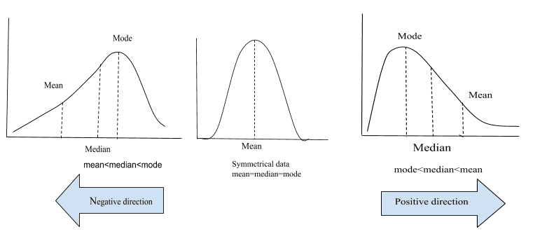
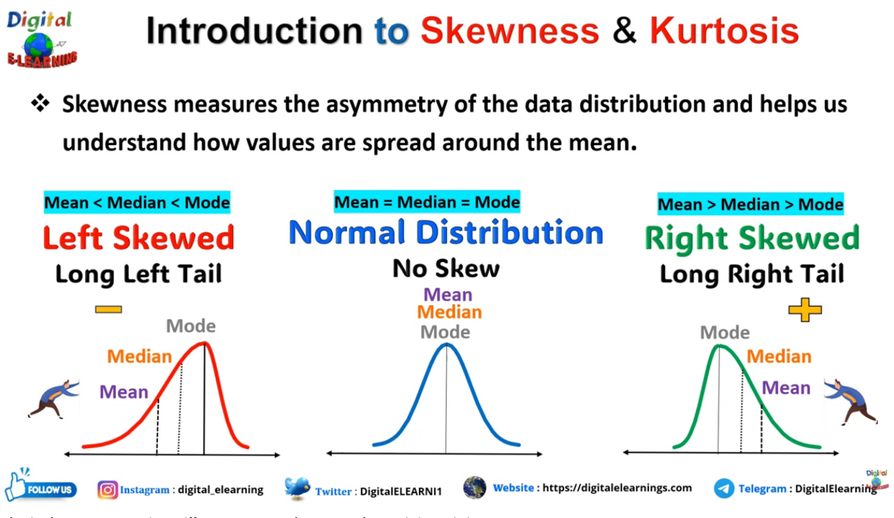
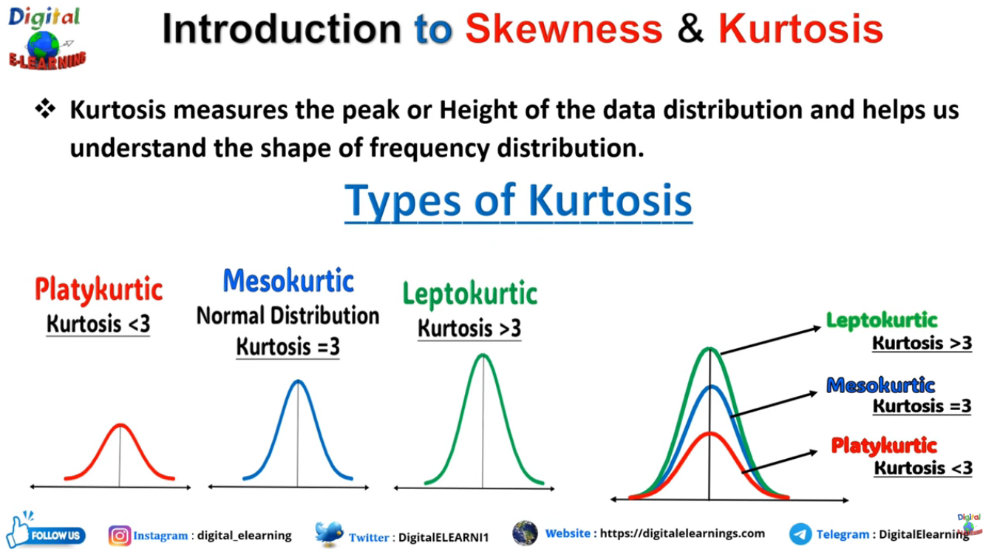

## Data Distribution - Skewness - Histogram

- Q) How do you identify whether a numerical data distribution is skewed?
- Q) How do you identify the direction of skewness from a histogram?
- Q) Skewness vs Kurtosis 

#### df.describe() gives a quick statistical summary of the numerical columns in a DataFrame.

- `Mean` → average value around which the data is centered.  it is calculated using every value and can be affected by extreme values
   - Gives a general idea of where the data is centered.
   - Compare mean with 50% (median) to get a quick hint about possible skewness.
   - **Mean can be pulled toward extreme values.**
   
- `mean vs 50% (median)` → Compare them to get a quick hint about **possible skewness**. Large difference may indicate skewness

    **Mean**
    - `Mean` → The **arithmetic average** of all values; it represents the average/center of the data.
    - Mean is **sensitive to extreme values** because every value contributes to the calculation.

    **Median**
    - `Median` → The **middle value** when the data is arranged in ascending order.
    - Median is **less affected by extreme values** compared with the mean.

    **Mode**
    - `Mode` → The **most frequently occurring value** in the data.
    - Mode represents the value around which the data has the **highest frequency**.

    **Using Mean, Median and Mode for Skewness**
    - **Symmetric** → `Mean ≈ Median ≈ Mode`
    - **Right / Positive skew** → `Mode < Median < Mean` → long tail toward the **right**; high values pull the mean upward.
    - **Left / Negative skew** → `Mean < Median < Mode` → long tail toward the **left**; low values pull the mean downward.
    - 
    - `Mean > Median` → Possible **right/positive skew** → **extreme high values pull the mean toward the right (upward)**. Since only a **small number of observations have very high values**, these values extend farther toward the right, creating a **long right tail →**, hence the name **right/positive skew**.
    - `Mean < Median` → Possible **left/negative skew** → **extreme low values pull the mean toward the left (downward)**. Since only a **small number of observations have very low values**, these values extend farther toward the left, creating a **long left tail ←**, hence the name **left/negative skew**.
    - `Mean ≈ Median` → No strong skew indicated → Values are distributed more **symmetrically** around the center, so there is no long tail clearly extending toward either side.

    **Histogram - Data Distribution - Skewness** :
    - A **histogram** is used to understand how the values of **one numerical column are distributed**.It does this by:
       - Steps :
          ```text
          1. Taking all the values in the column.
          2. Dividing the value range into **bins** (intervals/ranges).
          3. Counting how many observations fall into each bin.
          4. Representing those counts using bars.
          ```
       - Therefore:
         - **X-axis** → Fare ranges (**bins**)
         - **Y-axis** → Number of observations (**count/frequency**)
         - **Bar height** → How many observations are in that range
       - For example,    `df["Fare"].hist()`
         - Suppose the data is:Fare values → 10, 20, 25, 30, 35, 40, 45, 60, 120, 150
         The observations are grouped into bins: `0–50` → **7 observations** ; `50–100` → **1 observation** ;  `100–150` → **1 observation** ; `150–200` → **1 observation**
         - Therefore, the `0–50` bar will be the **tallest**, because most observations fall in that range.
         - 

       - The histogram helps us visually identify:
          - Where most values are concentrated
          - How spread out the values are
          - Whether the distribution is **symmetric or skewed**
          - Whether there are unusually extreme values

      - **Example of right skewness:**
          - If most passengers have Fare values between **0–50**, but only a few passengers have very high fares like **300–500**, the bars will be concentrated on the left and a few smaller bars will extend toward the right.
          - These few high values create a **long right tail →**, indicating a **right/positive skewed distribution**.

      - **Important:** The histogram does not create skewness. It **shows the distribution**, allowing us to visually observe skewness.

    - Histogram reasoning for skewness :
      - **Right / Positive skew** → Many observations are concentrated at **lower-medium values**, while a **small number of very high values** extend farther toward the right.
         - Histogram → More/taller bars toward the lower values + fewer/shorter bars continuing toward higher values.
         - These few high values create the **long right tail →**.
         - The high values pull the **mean toward the right/upward**.
         - Therefore → `Mean > Median` → **Right / Positive skew**.

      - **Left / Negative skew** → Many observations are concentrated at **higher values**, while a **small number of very low values** extend farther toward the left.
         - Histogram → More/taller bars toward the higher values + fewer/shorter bars continuing toward lower values.
         - These few low values create the **long left tail ←**.
         - The low values pull the **mean toward the left/downward**.
         - Therefore → `Mean < Median` → **Left / Negative skew**.

    - The side where the few extreme values stretch out is the side where the tail is — and that is what determines the name of the skew.
       - So few high values → right tail → right/positive skew.
       - Few low values → left tail → left/negative skew.

    - **Skewness ≠ Outliers**
       - **Skewness** → describes the **overall shape/asymmetry** of the distribution.
       - **Outlier** → an **individual value** that is unusually far from the rest.
       - For example, if most fares are ₹10–₹50 but a few fares are ₹300–₹500:
          - Those ₹300–₹500 values may be **outliers**.
          - They extend the distribution toward the **right**, creating a **right-skewed distribution**.
          - They also pull the **mean upward**.
       - So,  **Outliers can cause skewness, but a skewed distribution does not necessarily mean it contains outliers.**

    - **Mean / Median / Skewness for categorical columns** → Generally **not meaningful** for ordinary categorical data.
       - **Types of Data:**
         - **Numerical** → Continuous (e.g., `Age: 24.5`) / Discrete (e.g., `Number of siblings: 2`)
         - **Categorical** → Nominal (no order, e.g., `Gender: Male/Female`) / Ordinal (has order, e.g., `Rating: Poor < Average < Good < Excellent`)
       - Some categorical columns may be represented using numbers, such as `Sex: 0/1` or `Pclass: 1/2/3`.
       - Even though they contain numbers, the numbers may represent **categories rather than continuous numerical values**.
       - Therefore, mean, median and skewness should **not automatically be interpreted like normal numerical data**.
       - For categorical columns, focus more on **value counts, frequency and proportions**.

- `min/max` → Look for extreme or unusual values / possible outliers.
  - `min` → The **smallest observed value** in the column.Very small/unusual values → Possible extreme values or data issues. Compare it with 25% (Q1) to see how far the lower extreme is from the main data.
  - `max` → The **largest observed value** in the column.Very large/unusual values → Possible extreme values or data issues. Compare it with 75% (Q3) to see how far the upper extreme is from the main data
  - `max - min` → Shows the **overall range** of the observed values, but it can be strongly affected by extreme values. - `max - min` → Shows the **range** of the data; a very small range **may indicate** a categorical/discrete column, but it does not necessarily mean the column is categorical.
  - Compare `min/max` with `25%` and `75%` to see whether values are unusually far from the main data.
  - Min/max alone **cannot prove** that a value is an outlier; use methods such as **IQR or box plot** later.
  
- `std` → Understand how spread out the values are around the mean. This number comes from looking at **every value's distance from the mean**.

  - Larger `std` → Values generally have **more variation** around the mean. Values have relatively high variation/spread
  - Smaller `std` → Values are generally **more concentrated** around the mean.
  - Compare std with the mean to understand whether the variation is small or large relative to the average.
  - `std` measures **spread**, not whether values are outliers.

- `25% and 75%` → Understand where the **middle 50% of data lies**.

  - `25% (Q1)` → 25% of the values are **at or below** this value.
  - `50% (Median)` → 50% of the values are **at or below** this value. Less affected by extreme values than the mean.Compare with mean to get a quick hint about possible skewness.
  - `75% (Q3)` → 75% of the values are **at or below** this value.
  - Therefore, `Q1 → Q3` contains the **middle 50% of the data**.
  - Q3 - Q1 → IQR, which measures the spread of the middle 50%.
  - Larger IQR → Middle 50% is more spread out.
  - Smaller IQR → Middle 50% is more concentrated.

- `min → 25% → 50% → 75% → max` → Get a quick idea of **how the values are distributed**.

  - Look at the **spacing between these points**.
  - Similar spacing → Values may be distributed relatively evenly.
  - Unequal spacing → May indicate **skewness, concentration, or extreme values**.
  - This gives a quick distribution overview before using plots such as a **histogram or box plot**.

- Missingness → Center → Skew → Range → Spread → Quartiles → Distribution → Possible outliers

<br>




